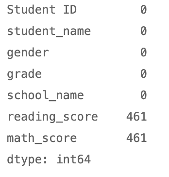
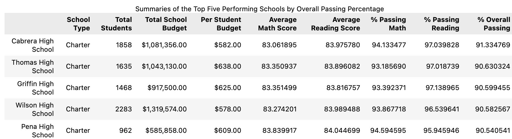
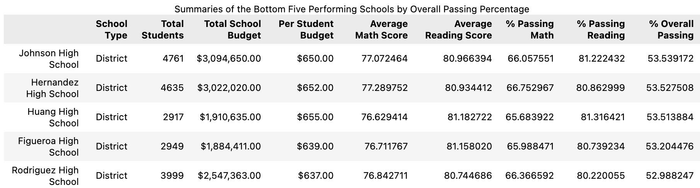
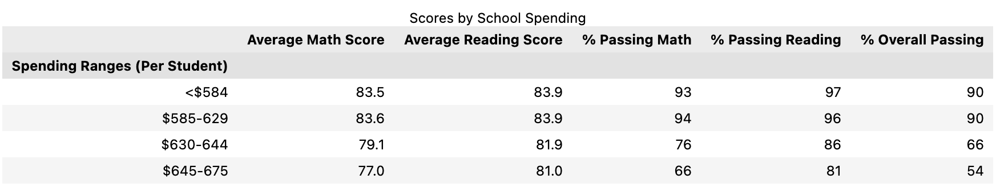
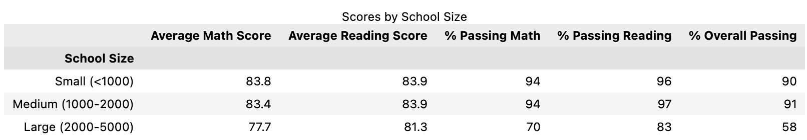
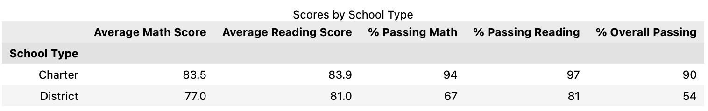
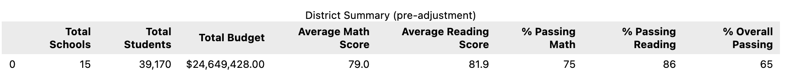
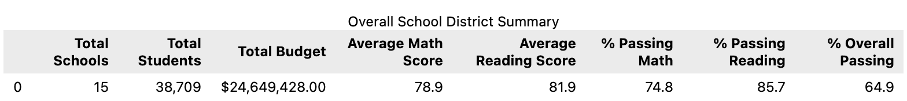
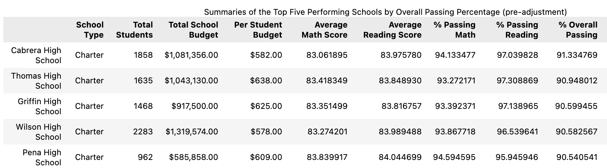

# School District Analysis

## Overview: 

The original purpose of this analysis was to create a high-level snapshot of the school district's key metrics, key metrics by each individual school, and various other analyses to determine school performance by school budget, school size, and school type.

The purpose of this analysis changed, however, when it was reported that the testing scores for ninth grade students at Thomas High School (THS) were allegedly altered, and rendered inadmissible. The ask then became to nullify those problematic scores, and refactor the code to not only extract the previously described key metrics, but to identify the impact that removing these grades had on the metrics.

### Nullifying the Grades

The following code was used to locate and replace Thomas High School's ninth grade scores:

```python
# Locate and replace the reading scores
student_data_df.loc[((student_data_df['grade'] == '9th') & (student_data_df['school_name'] == 'Thomas High School')),'reading_score'] = np.nan

# Locate and replace the math scores
student_data_df.loc[((student_data_df['grade'] == '9th') & (student_data_df['school_name'] == 'Thomas High School')),'math_score'] = np.nan

# Check the data to verify the NaN values
student_data_df.isnull().sum()
```

The final line of code yielded the following output, with 461 equalling the student count in the ninth grade at THS:



The THS metrics were then rebuilt, calculating percentages based on a total school student count minus ninth graders. 

### Key Metrics

Before addressing the impact that removing grades had on the metrics, the end results of the analysis must be presented:





Note: One observation right out of the gate - based on the data above, Charter schools far out-perform District schools.







## Results: 

The impact had on the data was the following:

- The **District Summary** saw minor drops in various categories:


  - The student count has decreased by 461, as expected.
  - **Average Math Score**, **% Passing Math**, **% Passing Reading**, and **% Overall Passing** metrics dropped slightly, but by a relatively insignificant amount.

- The **School Summary** charts shows no change for all schools except THS since only THS data was altered. Given that the summaries are calculated per school, it's only when data is aggregated that overall impact is seen.




  - **Note** - only THS averages and percentage calculations show differences.
  - **Error Identified** - in the steps provided by this exercise, the `per_school_counts` DataFrame was never identified as needing to be altered in order to reflect the removal of THS ninth graders. You will notice in the above screenshots that the "Total Student" value remains unchanged, yet in the District Summaries the "Total Students" value is reduced by 461. Though this head count bears no impact on the calculations (THS averages and percentages are calculated using tenth-twelfth grade students only), the oversight is worth documenting for future exercise instruction revisions.
  
- **THS's Relative Performance** shows minor change, thanks to the extra work done to recalculate metrics used THS total students minus ninth graders. THS's standing against other schools remains unchanged.
  - Average Math Score: 83.41 became 83.35
  - Average Reading Score: 83.85 became 83.9
  - % Passing Math: 93.27 became 93.18
  - % Passing Reading: 97.31 became 97.02
  - % Overall Passing: 90.95 became 90.63
- Data replacement also had the following effects:
  - Math and reading scores by grade
    - Thomas High School	nan	83.1	83.5	83.5 (pre-adjustment)
    - Thomas High School	nan	84.3	83.6	83.8
  - Scores by school spending
    - 
  - Scores by school size
  - Scores by school type
  
## Summary: 

Summarize four changes in the updated school district analysis after reading and math scores for the ninth grade at Thomas High School have been replaced with NaNs.